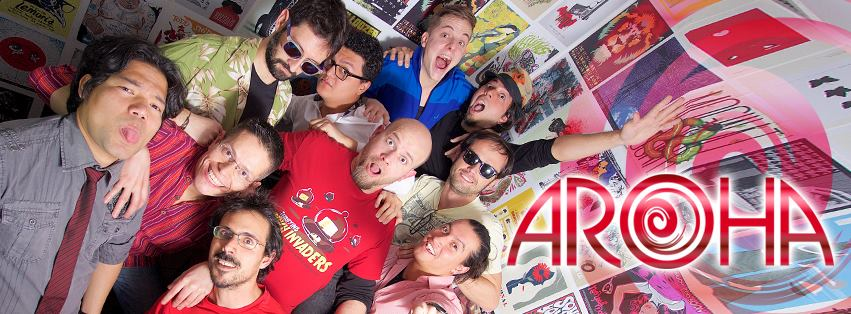
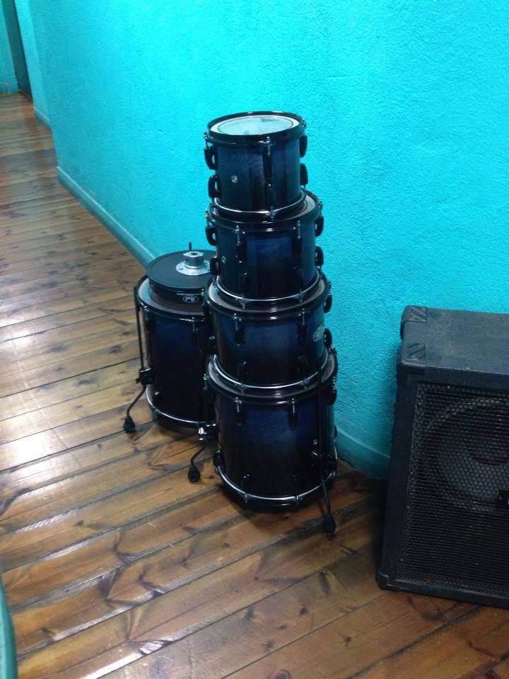

# AROHA-Sound-Reactive-Drums

### Batería

Todo el proyecto se desarrolla sobre esta batería

- Dimensiones:
	- Bombo 22"
	- Tom-Tom Medio 10"
	- Tom-Tom Alto 12"
	- Tom-Tom Piso 16"

### Software:
- [Firmdata (especial para Node-pixel)](/firmdata)
- [Node.js](https://nodejs.org/en/)
- [Johnny-Five](http://johnny-five.io/)
- [Node-pixel](https://github.com/ajfisher/node-pixel)

### Hardware:

- Arduino UNO (compatible)
- [Adafruit Neopixel Digital rgb led strip](https://www.adafruit.com/products/1376)
- [Adafruit Micrófono MAX4466](https://www.adafruit.com/product/1063)

### Versiones

**0.0.1 - Prueba de concepto**

- Descripción:
Versión básica desarrollada en un cubo de plástico para mejorar la movilidad.

- Incluido:
En esta prueba de concepto solamente se incluye una tira de Leds NeoPixel de 1m (pin 6) y un micrófono (pin A0). Se incluyen calculos básicos para transformar el sonido en iluminación.

